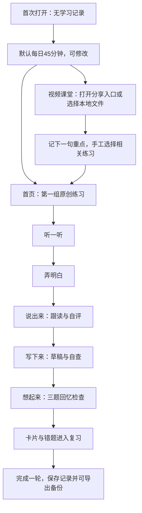
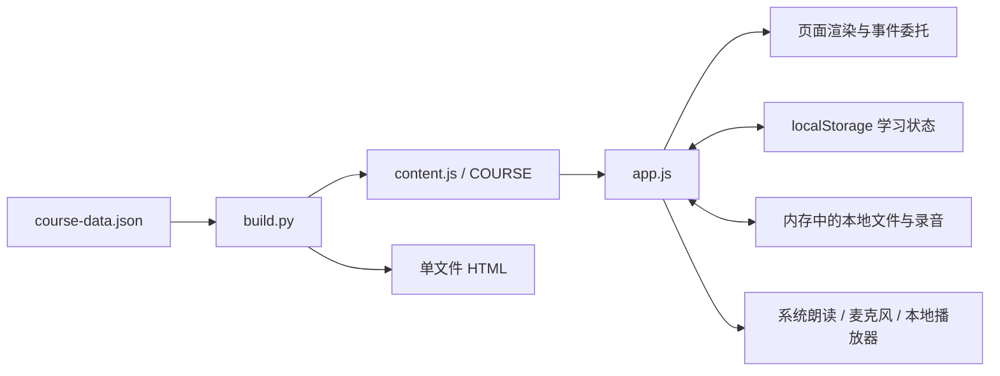

# 初语｜零基础到雅思 8 分学习 Web 开发文档

> 文档版本：1.0  
> 编写日期：2026-09-29  
> 适用对象：产品设计、前端开发、后端开发、测试，以及接手项目的 AI 编程工具  
> 项目基线：本对话已交付的「初语」本地学习程序  
> 文档性质：产品需求、现有实现说明、增量开发方案与验收标准

**项目定位：为英语零基础学习者提供一个“视频学习 → 听说读写练习 → 主动回忆 → 复习 → 记录进步”的个人学习空间。新概念英语是前期学习主线，雅思 8 分是长期目标，不是课程完成奖励。**

本文依据交付包中的源码、课程数据与说明文件编写，不把页面效果图或早期设想视为已经实现的功能。文中使用以下状态：

| 状态 | 含义 |
| --- | --- |
| 已实现 | 当前源码中可以定位到对应逻辑；真实设备兼容性仍以测试为准。 |
| 部分实现 | 存在基础交互，但不具备完整的自动化、评估或跨设备能力。 |
| 待开发 | 本文提出的下一步需求，当前交付包不包含。 |
| 不在范围 | 不应在本次增量开发中默认实施。 |

**阅读提醒：** 当前程序没有后端、账号、云同步、AI 批改、自动语音评分、完整雅思模考，也没有读取用户网盘中的实际课程目录。源码中的分享链接和提取码属于用户提供的资源配置，公开发布前必须移除或改为用户私有配置。

---

## 目录

1. [项目目标与用户画像](#s01)
2. [版本范围与功能清单](#s02)
3. [学习路线与课程组织](#s03)
4. [信息架构、路由与用户流程](#s04)
5. [页面开发规格](#s05)
6. [核心业务规则](#s06)
7. [视频、朗读与录音](#s07)
8. [当前技术架构与源码结构](#s08)
9. [数据模型与持久化](#s09)
10. [课程内容开发规范](#s10)
11. [备份、迁移与异常处理](#s11)
12. [交互、视觉与无障碍要求](#s12)
13. [运行、构建与部署](#s13)
14. [增量架构与服务端接口草案](#s14)
15. [安全、隐私与资源使用边界](#s15)
16. [测试计划与验收标准](#s16)
17. [开发任务拆解与优先级](#s17)
18. [已知限制与技术债](#s18)
19. [交接给开发者的执行说明](#s19)
20. [源码依据与本次核对记录](#s20)

---

<a id="s01"></a>
## 1. 项目目标与用户画像

### 1.1 用户的明确需求

| 维度 | 当前要求 |
| --- | --- |
| 英语基础 | 英语小白，从基础短句和日常表达起步。 |
| 长期目标 | 面向雅思 8 分设计路线，区分总分目标与四个单项目标。 |
| 已有资源 | 用户提供了「新东方新概念」视频课程的百度网盘分享入口。 |
| 产品形态 | 可以实际使用的 Web 程序，不只是学习建议或页面截图。 |
| 使用方式 | 先支持个人本地使用，再按需升级为手机可访问的线上版本。 |
| 默认日程 | 每天 45 分钟是产品初始值，不是用户已确认的可用时间；允许随时调整。 |

### 1.2 产品要解决的问题

学习者打开网站后，需要直接知道“今天练什么、怎样开始、做完以后怎么复习”，而不是再次挑选大量资料。视频是输入材料，程序必须同时安排可完成的输出任务，并保留个人记录。

主要目标是降低开始学习的操作成本、建立稳定练习流程、保留有意义的学习证据。不要把播放时长、课程浏览量或连续签到天数包装成英语水平。

### 1.3 成功标准

产品交付成功应首先体现在以下闭环：用户能完成第一组练习，保存写作与自评，生成复习卡；退出后在同一运行环境恢复记录；可以导出备份并成功恢复。

学习效果相关的数据只作为观察指标，例如隔天能否回忆表达、是否完成真实口头任务、同类错题是否反复出现。未经可靠评估，不显示“已达到 A1/C1”“预计雅思 8 分”等结论。

### 1.4 非目标

本产品不承诺固定天数达到雅思 8 分；不以学完新概念某一册等同某个雅思分数；不把总分 8 默认解释为四项都到 8；不提供未经授权的教材与商业课程分发；不自动登录或解析网盘；不把简单词数检查包装成写作批改。

---

<a id="s02"></a>
## 2. 版本范围与功能清单

### 2.1 现有交付基线

| 模块 | 当前状态 | 已有能力 | 明确边界 |
| --- | --- | --- | --- |
| 今日学习 | 已实现 | 下一组推荐、计划时长、专注计时、学习入口 | 推荐是简单顺序规则，不是智能诊断。 |
| 成长路线 | 部分实现 | 六阶段展示、能力自查说明、进入阶段练习 | 没有入学测试、能力认证和强制闯关。 |
| 练习教室 | 已实现 | 30 组原创练习、阶段筛选、主题搜索、五步学习 | 不是完整的新概念配套课，也不是完整雅思课程。 |
| 视频课堂 | 部分实现 | 网盘入口、本地视频导入、播放、笔记、分册、练习关联 | 无网盘目录读取、在线播放流接入或自动内容理解。 |
| 朗读与口语 | 部分实现 | 系统英文朗读、麦克风录音、回放、录音另存、自评 | 不识别发音、不自动打分；声音依赖设备能力。 |
| 写作 | 部分实现 | 草稿、词数、格式提示、自查确认 | 不纠正语法，不判断论证质量，不给雅思分。 |
| 复习与错题 | 已实现 | 表达卡、自建卡、到期复习、三档回忆反馈、错题标记 | 使用简单间隔规则，不是个体化记忆预测。 |
| 学习记录 | 已实现 | 日期记录、练习完成、复习次数、事件、手工成绩 | 记录不等于掌握；成绩来源由用户声明。 |
| 数据管理 | 已实现 | 本机保存、JSON 备份、替换导入、Markdown 笔记导出、清空 | 没有跨设备同步；备份不含视频和录音。 |
| 手机体验 | 部分实现 | 响应式页面与移动导航 | 不保证所有手机能直接执行本地 HTML。 |

### 2.2 版本规划

| 版本代号 | 目标 | 范围 |
| --- | --- | --- |
| Local v1 | 已交付的本地学习版 | 以现有源码为准，保持无需账号的使用方式。 |
| Local v1.1 | 优先开发：可靠性与可维护性 | 数据保护、结构化课程校验、测试入库、模块拆分、设备回归。 |
| Online v2 | 按需开发：同一用户跨设备继续学习 | 私有账号、同步、迁移、冲突处理、资源配置。 |
| Coach v3 | 单独立项：可靠的辅助反馈 | 口语转写、写作建议、教师反馈或 AI 辅助，不冒充正式评分。 |

这些版本是依赖顺序，不是工期承诺。当前交付物仍为 Local v1。

---

<a id="s03"></a>
## 3. 学习路线与课程组织

### 3.1 六阶段路线

当前课程数据来自 `src/course-data.json`。阶段以能力命名，不以分数承诺命名。

| stage | 阶段 | 当前主线提示 | 当前练习数量 | 能力方向 |
| --- | --- | --- | --- | --- |
| 0 | 零基础起步 | 新概念第一册＋发音入门 | 8 | 自我介绍、名字和数字、请求重复。 |
| 1 | 生活表达 | 新概念第一册 | 8 | 日常安排、物品位置、点餐与问路。 |
| 2 | 连贯表达 | 新概念第二册＋分级听读 | 8 | 讲经历、说计划、使用连接表达。 |
| 3 | 雅思桥梁 | 第二册选篇＋样题 | 2 | 认识任务形式，区分主旨细节，回答并说明理由。 |
| 4 | 专项提升 | 第三册选篇可选＋专项材料 | 2 | 同义改述、段落展开、反馈后修改。 |
| 5 | 高阶训练 | 完整任务与分项反馈方向 | 2 | 复杂观点、表达准确性、完整任务中的稳定表现。 |

合计 **24 组基础练习＋6 组雅思相关微练习**。每组有 3 个目标表达，可产生 90 个内置卡片条目；这不是去重后的“已掌握词汇量”，也不意味着初次进入已经拥有 90 张卡片。

### 3.2 教材、视频、站内练习的关系

三者必须保持独立身份：

```text
教材参考：第一册 / 第二册 / 第三册选篇等
       ↓ 人工教学设计
课程视频：用户实际持有的视频资源
       ↓ 人工填写册别、标题、关联练习
原创练习：u01、u02……，可独立练习
       ↓ 完成练习、生成复习
学习记录：步骤、自评、写作、错题、回忆反馈
```

当前 `video.unitId` 最多关联一组站内练习，是用户手工选择的关联，不是系统验证过的教材对应关系。不得根据文件名猜测课程内容并自动声称“已匹配第几课”。

### 3.3 下一版课程扩展原则

先补足第一册相关能力的连续训练，再扩大中高阶内容。每个阶段需要同时包含输入、口头表达、书面表达与复习，不要等四册全部学完才引入口语和写作。

待开发的阶段检查可以记录“完成了哪些任务、提示使用情况、错因和反馈”，但阶段推进只作为学习建议。允许预览后续内容、复练之前内容，不将路径锁定机制作为学习成效证明。

---

<a id="s04"></a>
## 4. 信息架构、路由与用户流程

### 4.1 路由表：当前实现

现有程序使用 URL hash 和页面容器切换，不依赖服务端路由。

| 页面 | 路由 | 渲染函数 | 说明 |
| --- | --- | --- | --- |
| 今日学习 | `#home` | `renderHome()` | 默认入口。 |
| 视频课堂 | `#video` | `renderVideo()` | 课程入口与本地播放器。 |
| 成长路线 | `#roadmap` | `renderRoadmap()` | 六阶段与能力说明。 |
| 练习列表 | `#library` | `renderLibrary()` | 按阶段和主题筛选。 |
| 五步练习 | `#study/u01` | `renderStudy()` | 单元 ID 参数可替换。 |
| 复习卡片 | `#review` | `renderReview()` | 到期卡片、全部卡片、错题。 |
| 学习记录 | `#progress` | `renderProgress()` | 行为记录与手工成绩。 |
| 目标设置 | `#settings` | `renderSettings()` | 时长、目标、声音、数据管理。 |

未知页面名回到首页；无效学习单元不会直接作为数据键使用，当前逻辑保留有效的 `currentUnit`。修改路由行为时，要覆盖直接访问、前进、后退和刷新。

桌面端主导航有 7 项。手机底部导航有 5 项：今日、视频、练习、复习、记录；成长路线与设置通过页面入口进入。不要将早期原型的四项底栏误写为当前实现。

### 4.2 首次学习流程



上图表示推荐顺序。当前界面允许切换步骤预览，不实施严格的按序锁定；每一步的完成条件仍需单独满足。

### 4.3 再次打开

先恢复本机状态，再根据 `currentUnit` 及步骤完成情况推荐下一组。视频文件不会随学习记录恢复：只能先显示视频元数据，再要求用户重新选择原文件。

### 4.4 开发交互底线

主任务只保留一个明显的开始按钮；音频不可用时仍可阅读练习；录音拒绝授权后仍可口头练习并自评。不能为了录音权限或账号注册阻断零基础用户的第一组练习。

---

<a id="s05"></a>
## 5. 页面开发规格

### 5.1 今日学习 `#home`

**目的：** 让用户不做选择题，直接进入当前任务。

现有页面应保留每日时长、下一组任务、练习进度、视频入口、专注计时和复习相关入口。默认空白状态不得出现虚构的连续学习天数、历史成绩或进度。

待开发改进：把“到期复习较多”展示为可选提醒，而不是继续无限推荐新课；用户选择减少新课时，明确展示当日变化，不自动改变长期目标。

验收重点：切换时长后，页面上的视频预算和五步预算一起更新；完成当前组后推荐下一未完成组；计时器不因打开页面而自动开始。

### 5.2 视频课堂 `#video`

页面由课程入口、本地播放器、文件列表、笔记区和相关练习入口组成。

| 操作 | 当前行为 | 异常状态 |
| --- | --- | --- |
| 打开课程入口 | 新标签页打开用户提供的百度网盘分享页 | 链接失效不影响站内原创练习。 |
| 复制提取码 | 优先使用剪贴板接口，失败时尝试回退或显示可复制文本 | 不显示伪成功提示。 |
| 导入视频 | 多选文件；支持时可选文件夹 | 没有视频时提示重新选择。 |
| 选择视频 | 使用用户选中的本地文件创建临时播放地址 | 只有元数据时要求重新选择。 |
| 分册与标题 | 用户手工填写 | 初次导入为“尚未分册”。 |
| 看课笔记 | 每个视频独立笔记；另有网盘总笔记 | 保存失败应引导备份。 |
| 插入时间 | 将当前播放时间插入笔记文本 | 没有可用播放器时禁用。 |
| 关联练习 | 选择一组原创练习，或使用默认推荐 | 不声称自动理解视频。 |
| 标记已看 | 自我记录，可取消 | 不触发练习完成和掌握状态。 |
| 删除记录 | 二次确认后移除元数据与笔记 | 不删除磁盘上的视频文件。 |

### 5.3 成长路线 `#roadmap`

每个节点显示阶段名称、训练重点、主线材料、本站练习数量和能力自查说明。选中阶段后显示详情与练习入口。

“8 分”可作为长期目标视觉标记，但不能显示从当前完成率计算出的“预估分数”。高阶段必须标注“微练习”，避免让用户误以为两组短练习就是完整备考阶段。

### 5.4 练习列表 `#library`

支持阶段筛选以及标题、英文标题、目标文本搜索。卡片显示主题、学习目标和五步完成数量。无搜索结果时提示换关键词，并提供清除筛选的可发现入口；后者可在 v1.1 中补强。

### 5.5 五步练习 `#study/:unitId`

| 步骤 | 页面内容 | 当前完成条件 |
| --- | --- | --- |
| 0 听一听 | 逐句英文与中文、整组/单句朗读、听读确认 | `listenAck === true`。这是自记，不检测实际收听。 |
| 1 弄明白 | 三个表达、一个语言重点、理解选择题 | 当前理解题回答正确。 |
| 2 说出来 | 口语任务、提示显隐、朗读、录音、自评 | 选择一个自评档位，不强制录音。 |
| 3 写下来 | 写作提示、草稿、词数、表面格式提示 | 达到本组 `minWords` 且勾选读回自查。 |
| 4 想起来 | 一道目标表达回忆题、两道选择题 | 三题都作答并提交检查；不要求全部答对。 |

五项 `steps` 均为 `true` 时显示“完成一轮”，不是“已掌握”。首次完成时间只记录一次；后续重练可更新内容，不新增一个虚构的首次完成。

### 5.6 复习卡片 `#review`

到期卡片正面呈现中文或情境提示。用户先回忆，再揭示英文答案，之后选择“没想起来／需要提示／独立想起”。未翻面不能提交评分。

全部卡片页支持浏览与立即复习；错题页保留题目、作答、参考答案、解释和解决标记。解决标记是用户自记或对应题目重答正确的结果，不是系统证明长期掌握。

### 5.7 学习记录 `#progress`

分开展示练习、复习、专注时间、视频自记和成绩。计时器只记录用户主动开启且符合前台计时条件的时间，不自动读取网盘播放时间。

成绩必须收集四项分数、日期、来源类别与可选备注。来源标签即使选“正式考试”，也要显示“自行录入”；当前程序不验证成绩单。

### 5.8 目标设置 `#settings`

设置项包括称呼、每日时长、总分或四项目标、四项分数、口音偏好、朗读速度、系统声音、备份导出导入、Markdown 笔记导出和清空。

清空需要输入“清空”二次确认。导入采用替换，不是合并，确认前必须展示备份中包含的内容数量。

---

<a id="s06"></a>
## 6. 核心业务规则

### 6.1 计划时长

当前允许值为 `30 / 45 / 60 / 90 / 120` 分钟，默认 45。

当前算法：

```javascript
const videoMinutes = Math.round(dailyMinutes / 3);
const practiceMinutes = dailyMinutes - videoMinutes;
const parts = [
  Math.round(practiceMinutes * 2 / 9), // 听一听
  Math.round(practiceMinutes / 9),     // 弄明白
  Math.round(practiceMinutes * 2 / 9), // 说出来
  Math.round(practiceMinutes * 2 / 9), // 写下来
];
const recallMinutes = practiceMinutes - parts.reduce((sum, n) => sum + n, 0);
```

45 分钟对应：看课 15 分钟，听读 7 分钟，理解 3 分钟，口语 7 分钟，写作 7 分钟，回忆 6 分钟。

这是任务预算，不是各环节强制倒计时，也不是普遍适用的教学标准。用户不看视频时仍能独立使用练习，但当前程序不会自动把视频预算重分配，后续可增加此选项。

### 6.2 下一组推荐

```text
当前单元存在且未完成 → 继续当前单元
否则 → 找到课程列表中的第一组未完成单元
全部完成 → 当前逻辑回退第一组
```

最后一种情况应在 v1.1 改为明确的“全部已练过，去复习或自由重练”状态，避免用户以为进度丢失。现有规则不参考考试日期、能力诊断或错题分布。

### 6.3 完成状态与证据边界

当前 `steps` 数组记录已经完成过的五步。修改写作或答案后，部分检查标志会重置，但历史 `steps` 并不会统一撤销，因此它更接近“曾练过这一步”，不能当作当前内容有效性断言。

下一版建议拆分：

```text
历史完成记录 everCompleted
当前作答状态 currentAttempt
延迟回忆证据 recallEvidence
教师/工具反馈 feedback
```

这四类记录都不能自动折算成雅思分数。

### 6.4 回忆检查与错题

每组的三道回忆题由 `quizSpec()` 生成：第一个目标表达的英文回忆、该组理解题、该组阅读理解题。

文本题使用规范化后的精确匹配：转小写、统一部分引号、移除部分标点、合并空白。当前不支持同义答案和语义评分。因此页面必须说明是在回忆“本组目标表达”，不要把其他合理说法判为用户英语错误。

错题按固定题目标识保存，新一次错误会覆盖该题已有错误记录；答对可以标为已解决。当前没有完整的逐次作答历史。

### 6.5 复习间隔

| 反馈 | 内部值 | 当前下次复习时间 | 等级变化 |
| --- | --- | --- | --- |
| 没想起来 | `again` | 当前时间后 10 分钟 | 归零。 |
| 需要提示 | `hard` | 当前时间后 1 天 | 降一级，最低为 0。 |
| 独立想起 | `good` | 按当前等级使用 1、3、7、14、30、60 天 | 升一级，最高为 5。 |

新生成卡片立即到期，初始等级为 0。到期判断为 `due <= Date.now()`，队列按到期时间升序排列。

这些间隔是确定性产品规则，不标注为经过个体校准的遗忘曲线。未来更换算法必须保存 `algorithmVersion`，并保留已产生的复习事件，避免升级后无法解释排程变化。

### 6.6 目标与成绩计算

当前顺序始终为：听力、阅读、写作、口语。

```javascript
function bandScore(scores) {
  return Math.round((scores.reduce((sum, n) => sum + n, 0) / 4) * 2) / 2;
}
```

本节描述现有程序的计算，不是对最新考试规则的独立核验。发布带有考试制度说明的正式页面前，应核对相应官方说明。

输入必须正好四项，各项为 0—9 的整分或半分。示例 `[8.5, 8.5, 7, 7]` 在现有算法中显示总分 `8.0`。

目标模式切换会重置默认组合：`overall` 为 `[8.5,8.5,7,7]`，`each` 为 `[8,8,8,8]`。下一版宜在切换前保留用户自定义组合或提示即将重置，避免无感覆盖。

### 6.7 专注计时

用户手动开始计时。页面隐藏时暂停；单次 tick 检测到超过 10 秒的间隔时视为可能休眠并暂停；累计值写入本地日期对应的 `days[date].seconds`。

视频观看标记与专注时间独立。专注时间不是有效学习质量的量化证明，也不自动触发学习步骤完成。

---

<a id="s07"></a>
## 7. 视频、朗读与录音

### 7.1 网盘资源配置

当前入口定义于 `src/app.js` 顶部的 `SHARE` 常量，课程名为「新东方新概念」。完整分享地址与提取码已在现有源码和交付说明中保存，本文不重复复制到公开配置示例。

当前集成方式：

```text
本站 → 打开分享页面 → 用户自行在网盘操作
本站 ← 用户手工记录笔记、选择本地文件或关联练习
```

没有资源读取授权流程、目录同步、自动下载、视频代理或网盘内播放进度同步。新需求不得把一个分享页面地址直接写进 `<video src>`。

待开发的资源设置页应允许用户自行填写分享地址、提取码和备注，默认只保存到自己的本机或私有账号。公开部署构建中必须移除用户专属默认值。

### 7.2 本地文件识别与生命周期

当前使用 `文件名 + NUL 分隔符 + 文件大小` 生成哈希标识。哈希碰撞但元数据不同时会附加后缀。**同名且大小相同、内容不同的文件仍可能被当成同一条记录**；它不是内容级去重。

文件对象保存在运行时的 `localVideos: Map`，不放入 `localStorage`。播放时创建对象 URL；切换页面、释放播放器时保存位置、停止播放并释放 URL。

```text
用户选择文件
  → 检查候选文件
  → 关联元数据 ID
  → 文件对象进入内存 Map
  → 创建临时对象 URL
  → loadedmetadata 后恢复 position
  → timeupdate 时更新位置，约每 2 秒落盘一次
  → pause / 离开页面时强制保存
  → 释放对象 URL
```

最多保存 2,000 条视频元数据。扩展名被接受只代表进入候选列表，不代表浏览器能解码；播放错误要提供明确提示，不伪装为资源已损坏的确定诊断。

当前播放倍速有 `0.75 / 1 / 1.25 / 1.5 / 2`，只保存在本次运行的 UI 状态；刷新后不会作为学习设置恢复。时间戳笔记目前是普通文本标记，不支持点击跳转。

### 7.3 浏览器朗读

使用 `speechSynthesis` 和 `SpeechSynthesisUtterance`，筛选英文声音；可选英式或美式口音。设置页提供 0.65、0.75、0.85、1、1.1 倍的朗读速度，数据清洗允许范围为 0.6—1.2。

朗读不是原版教材音频。设备可能没有可用英文声音，部分系统声音可能依赖网络。页面应展示检测结果；没有声音时仍保留文本、跟读提示与自评路径。

### 7.4 录音

录音前检查安全上下文、麦克风接口和 `MediaRecorder`。只在用户操作后请求麦克风；拒绝授权、找不到设备、接口不可用都需要单独反馈。

当前单次录音最多 120 秒，停止后可回放、单独下载。录音 Blob 保存在内存，离开相关流程会清理，不随 JSON 备份保存。

离页或取消录音必须停止音轨并释放临时 URL。录音进行中不播放参考朗读，避免互相干扰。是否在切换到后台时停止、是否释放真实设备权限，需要真机测试。

---

<a id="s08"></a>
## 8. 当前技术架构与源码结构

### 8.1 技术基线

| 层次 | 当前实现 |
| --- | --- |
| 页面结构 | 原生 HTML，单个主页面容器。 |
| 样式 | 原生 CSS、响应式媒体查询、系统字体、内联 SVG 图标。 |
| 交互 | 原生 JavaScript，IIFE 封装、模板字符串渲染、事件委托。 |
| 路由 | hash＋History API，服务端无需业务路由。 |
| 课程内容 | JSON 为编辑源，构建生成 `content.js` 中的 `COURSE` 常量。 |
| 用户数据 | `localStorage` 中的单个版本化状态对象。 |
| 临时媒体 | 内存 `Map`、Blob、对象 URL。 |
| 构建 | Python 脚本内联 CSS 和 JavaScript，输出单文件 HTML。 |
| 本地服务 | Python 标准库静态文件服务器，只监听本机。 |
| 服务端业务 | 无。 |

不要把未来的账号接口、关系型数据库或 AI 服务写进“当前依赖”。当前没有 `package.json`，运行现有程序不需要 `npm install`。

### 8.2 交付目录

```text
初语_学习程序/
├── README_从这里开始.md
├── 测试说明.md
├── build.py
├── start.py
├── 启动学习_Windows.bat
├── 启动学习_macOS.command
├── 初语_零基础到雅思8_学习程序.html   # 生成产物
├── src/
│   ├── index.html
│   ├── styles.css
│   ├── app.js
│   ├── course-data.json             # 课程编辑源
│   └── content.js                   # 自动生成，不应手工维护
└── 预览/
    ├── 学习首页_桌面.png
    ├── 学习首页_手机.png
    ├── 练习教室_桌面.png
    ├── 视频课堂_桌面.png
    └── 视频课堂_手机.png
```

### 8.3 运行结构



### 8.4 关键代码定位

| 逻辑 | 入口 |
| --- | --- |
| 默认状态与版本 | `KEY`、`fresh()`、`blankProgress()` |
| 存储清洗与恢复 | `sanitize()`、启动读取逻辑、`save()` |
| 路由与生命周期 | `readRoute()`、`go()`、`render()` |
| 五步完成 | `markStep()`、`submitQuiz()` |
| 错题与复习 | `addMistake()`、`ensureCards()`、`gradeCard()` |
| 视频 | `importVideos()`、`attachVideo()`、`saveVideoPosition()`、`releaseVideo()` |
| 音频 | `speakTexts()`、`toggleRecording()`、`clearRecording()` |
| 数据导出导入 | `exportBackup()`、`previewImport()`、`exportNotes()` |
| 页面交互 | `data-action`、`data-change` 与全局事件委托 |

---

<a id="s09"></a>
## 9. 数据模型与持久化

### 9.1 当前存储约定

```text
主键：chuyu8.learning.v1
数据版本：schemaVersion = 1
课程版本：course-data.json 中 version = 1
时间戳：毫秒 Unix 时间戳
按日记录键：设备本地日期 YYYY-MM-DD
保存方式：JSON.stringify(state) 后写入 localStorage
```

`file://`、不同协议、主机名或端口下的数据不能假设互通。`localhost` 和 `127.0.0.1` 也应作为不同访问入口处理。部署到 HTTPS 后，不应告诉用户旧本地数据会自动出现，而应提供导出导入迁移流程。

### 9.2 现有模型的类型化说明

以下 TypeScript 仅用于精确定义当前数据形状，不表示现有源码已经改用 TypeScript。

```typescript
type UnitId = string; // 现有卡片/错题清洗规则依赖 u01 这样的两位格式

type GoalMode = 'overall' | 'each';
type SelfRate = '' | 'read' | 'prompt' | 'independent';
type ReviewGrade = '' | 'again' | 'hard' | 'good';
type BookId = 'book1' | 'book2' | 'book3' | 'book4' | 'other';

interface Targets {
  listening: number;
  reading: number;
  writing: number;
  speaking: number;
}

interface Profile {
  name: string;
  dailyMinutes: 30 | 45 | 60 | 90 | 120;
  goalMode: GoalMode;
  targets: Targets;
  accent: 'en-GB' | 'en-US';
  rate: number;
  voice: string; // 浏览器 voiceURI，不能假设跨设备仍然有效
}

interface UnitProgress {
  step: number; // 0..4，当前显示步骤
  steps: [boolean, boolean, boolean, boolean, boolean];
  listenAck: boolean;
  understandAnswer: number | null;
  understandCorrect: boolean;
  selfRate: SelfRate;
  writing: string;
  writingReviewed: boolean;
  quizAnswers: [string, string, string]; // 选择题以选项索引字符串保存
  quizSubmitted: boolean;
  quizScore: number; // 0..3，不是英语等级或雅思分
  quizCorrect: [boolean, boolean, boolean];
  finishedAt: number | null;
  updatedAt: number;
}

interface ReviewCard {
  id: string; // 内置 u01-w0；自建 c-...
  en: string;
  zh: string;
  context: string;
  unitId: UnitId | null;
  due: number;
  level: number; // 0..5
  reviews: number;
  createdAt: number;
  lastGrade: ReviewGrade;
  lastReviewed: number | null;
}

interface Mistake {
  id: string; // u01-check 或 u01-quiz0 等
  unitId: UnitId;
  q: string;
  answer: string;
  userAnswer: string;
  explain: string;
  resolved: boolean;
  at: number;
}

interface StudyDay {
  seconds: number;
  actions: string[]; // 如 u01:0，同一天去重
  reviews: number;
}

interface ExamRecord {
  id: string;
  date: string;
  type: 'mock' | 'official'; // 用户声明，均未认证
  scores: [number, number, number, number]; // 听、读、写、说
  note: string;
}

interface StudyEvent {
  at: number;
  text: string;
  kind: string;
}

interface VideoRecord {
  id: string;
  name: string;
  size: number; // 字节
  position: number; // 秒
  duration: number; // 秒
  note: string;
  book: BookId;
  lesson: string;
  unitId: UnitId | '';
  watched: boolean; // 仅“已看”自记
  updatedAt: number;
}

interface LearningStateV1 {
  schemaVersion: 1;
  createdAt: number;
  profile: Profile;
  currentUnit: UnitId;
  units: Record<UnitId, UnitProgress>;
  cards: Record<string, ReviewCard>;
  mistakes: Record<string, Mistake>;
  days: Record<string, StudyDay>;
  exams: ExamRecord[];
  events: StudyEvent[];
  videos: Record<string, VideoRecord>;
  selectedVideo: string;
  cloudNote: string;
  lastBackupAt: number | null;
}
```

`cloudNote` 是“网盘看课总笔记”的历史字段名，**实际仍只保存在本机**，不要按字段名误认为已同步到云端。

### 9.3 不能持久化的运行状态

`ui` 保存当前页面、筛选条件、翻卡状态等；`localVideos` 保存真实 File 对象；`rec` 保存录音流、Blob 与 URL；`focus` 保存计时器运行状态。这些对象不能直接 JSON 序列化写入学习备份。

### 9.4 当前导入与清洗限制

| 数据项 | 当前限制或规则 |
| --- | --- |
| 备份文件 | 不超过 5 MiB，先解析再确认导入。 |
| 称呼 | 最长 24 个字符串代码单元。 |
| 写作、视频笔记、总笔记 | 各字段最长 12,000。 |
| 视频记录 | 清洗最多接受 2,000 条；导入新视频时也检查此上限。 |
| 复习卡 | 清洗最多接受 3,000 条。 |
| 错题、成绩、事件 | 各最多清洗接受 1,000 条；事件运行中保留最近 1,000 条。 |
| 按日记录 | 清洗最多接受 4,000 项，必须为有效且不晚于今天的日期。 |
| 自建卡英文/中文/上下文 | 分别限制为 120 / 200 / 700。 |
| 视频课题 | 最长 120。 |
| 成绩备注 | 最长 250。 |
| 分数 | 0—9 的整分或半分。 |

这些是代码中的校验上限，不是浏览器实际可用容量保证。部分集合仅在导入/启动清洗时截取，运行时未统一限制，因此可能出现当次创建成功、下次恢复时被截掉的记录；需要优先修复。

---

<a id="s10"></a>
## 10. 课程内容开发规范

### 10.1 课程源格式

```typescript
interface ChoiceQuestion {
  q: string;
  options: [string, string, string];
  answer: 0 | 1 | 2;
  explain: string;
}

interface CourseUnit {
  id: string;
  stage: number;
  title: string;
  enTitle: string;
  goal: string;
  lines: Array<{ en: string; zh: string }>;
  words: [
    { en: string; zh: string },
    { en: string; zh: string },
    { en: string; zh: string }
  ];
  note: string;
  speak: string;
  write: string;
  check: ChoiceQuestion;
  readingQuiz: ChoiceQuestion;
  minWords: number;
}
```

当前根节点有 `version`、`stages`、`units`。阶段对象包含 `id/title/short/label/book/focus/ability/next/tag`。

### 10.2 新增一组课程的流程

先定义一个可执行的能力目标，再编写例句、三个目标表达、简短中文解释、口语替换任务、写作任务、理解题与阅读题。检查答案确实能由材料支持，而不是靠猜测。

编辑 `course-data.json`，分配唯一且稳定的 ID，运行课程校验，再执行 `python build.py`。最后同时验证多文件版和生成的单文件版。不要直接编辑 `content.js`，否则下一次构建会覆盖。

现有数据绑定了三张表达卡、三道回忆题和三项选择题。如果要改成每组五个词、可变题量或长篇模考，必须先升级渲染与数据模型，不能只改 JSON。

### 10.3 内容质量要求

中文解释首先说明使用场景，再补充术语。例句要允许用户替换姓名、地点、时间等真实信息。写作建议长度与 `minWords` 完成门槛要同时呈现，避免把最低门槛误读为完整练习目标。

每组需要有人审查英文自然度、中文对应、答案唯一性、任务难度和材料来源。课程发布后不复用旧 ID 表示不同主题，否则已有进度、错题与复习卡会指向错误内容。

### 10.4 待开发的内容元数据

下一版建议添加 `contentVersion`、`sourceKind`、`sourceRef`、`rightsNote`、`reviewStatus`、`reviewedAt` 和人工确认的 `curriculumRefs`。这些字段仅为扩展设计，当前课程 JSON 不含。

第一版可继续人工编辑 JSON。在线内容管理后台不属于本地稳定性修复的必要条件。

---

<a id="s11"></a>
## 11. 备份、迁移与异常处理

### 11.1 当前备份行为

导出文件直接包含 `LearningStateV1`，不是一个外层包裹 `state` 的新格式。任何后续导入器都必须识别这一现有格式。

包括：目标设置、单元进度、写作、卡片、错题、日期记录、事件、成绩、视频元数据、播放位置和笔记。不包括：实际视频、录音、网盘登录态、用户账号或服务器令牌。

`lastBackupAt` 表示程序发起生成备份的时间，不证明用户真的保存了文件。现有“导入成功”也不能作为底层持久化一定成功的证明；落盘失败必须在 v1.1 中单独处理。

### 11.2 当前导入流程

```text
选择 JSON
  → 文件大小检查
  → 解析 JSON
  → sanitize() 清洗
  → 显示内容数量与替换说明
  → 用户明确确认
  → 暂停计时与媒体，清理运行时文件引用
  → 替换内存状态
  → 尝试保存
  → 返回首页
```

解析失败或根版本不支持时不覆盖现有学习记录。个别条目无效时，当前会丢弃或截断，不提供详细丢弃清单。

### 11.3 v1.1 的必要改进

导入预览要展示被丢弃、截断、修正的内容数量和原因；确认前生成可下载的旧数据快照。保存函数返回成功或失败，导入成功提示以持久化结果为依据；保存失败时保留导出新旧数据的能力。

对导入的派生字段，如小测分数和正确标记，应根据保留的答案重新计算；对历史完成标记应保留其来源，不能把用户导入的任意数据用于认证或奖项。

### 11.4 面向 v2 的迁移规则：待开发

```text
读取原始字节并保留备份
  → 识别 schemaVersion
  → validateV1
  → migrateV1ToV2（纯转换，不改写旧数据）
  → validateV2
  → 显示迁移摘要
  → 写入新存储并回读验证
  → 切换到新版本
```

课程内容版本与用户状态版本分开管理。未知未来版本只提示不支持，绝不能退回空白状态后自动覆盖原文件。

线上迁移时，由用户明确选择是否上传本地写作、笔记与成绩。视频元数据可迁移，但媒体文件仍需另行处理，不能让用户误以为有播放记录就能在新设备播放。

---

<a id="s12"></a>
## 12. 交互、视觉与无障碍要求

### 12.1 当前视觉基线

风格为暖白背景、深绿色文字与主色、浅绿色强调。页面以中文引导为主，英文承担学习内容，不以大段英文导航增加零基础用户的理解负担。

| CSS 变量 | 当前值 | 用途 |
| --- | --- | --- |
| `--bg` | `#f5f6f0` | 全局背景。 |
| `--paper` | `#fffefa` | 卡片底色。 |
| `--ink` | `#243e33` | 正文与标题。 |
| `--green` | `#2e674d` | 主色。 |
| `--deep` | `#234b3b` | 深色重点区域。 |
| `--lime` | `#d9edb3` | 重点提示。 |
| `--muted` | `#6f7c6d` | 次级文字。 |
| `--line` | `#e1e6da` | 边框。 |
| `--r` | `20px` | 主卡片圆角。 |

字体使用系统字体栈，无需分发字体文件。基础桌面侧栏宽 224px，部分断点缩窄；手机隐藏侧栏并使用底部导航。

### 12.2 响应式要求

保持桌面主内容与辅助面板的关系，手机按“当前任务 → 操作 → 说明”重排。视频不能挤压笔记输入，长英文、长文件名和表格应有局部换行或滚动策略，不导致整个页面横向滚动。

回归宽度至少覆盖 320、390、768、1024、1440px，手机还需测试软键盘弹出、横竖屏切换和底栏遮挡。上述是验收矩阵，不是本次已完成真机兼容的声明。

### 12.3 可访问性交互

现有源码包含焦点可见样式、输入标签、状态播报、原生对话框、对话框关闭后恢复触发焦点以及减少动态效果的样式分支，但尚未完成完整的可访问性审计。

下一版要求所有功能可键盘访问，正确和错误状态同时有文字而不只依赖颜色；正文可放大；手机主要点击区以至少 44×44 CSS 像素为产品目标，并检查当前小按钮。长文本输入时不能因重新渲染丢失焦点或光标位置。

### 12.4 文案规则

使用“完成一轮”“已看（自记）”“口语自评”“写作尚未批改”“成绩自行录入”。不要使用“系统已认定掌握”“看完这册就是雅思 X 分”“AI 精准预测通过日期”。

空状态、加载状态、授权失败和持久化失败应有各自文案，不能让所有问题都表现为一个无响应按钮。

---

<a id="s13"></a>
## 13. 运行、构建与部署

### 13.1 直接打开单文件

用电脑浏览器打开根目录的 `初语_零基础到雅思8_学习程序.html`。不要在聊天软件、网盘文件预览器内把预览效果等同于真实运行。

该方式不要求 Node.js 或 Python；但录音、存储、系统声音等行为需要在用户设备确认。切换到本机服务或线上地址前先导出备份。

### 13.2 本机服务

在完整解压后的项目根目录运行，交付说明的运行基线为 Python 3.9 或以上：

```bash
python start.py
```

系统命令为 `python3` 时使用：

```bash
python3 start.py
```

程序默认打开：

```text
http://localhost:8768/
```

只监听 `127.0.0.1`，服务目录是 `src/`，不是互联网服务器，不给其他设备提供访问。停止时按 `Ctrl+C`。固定浏览器、主机名和端口使用；不要随意换端口来规避数据问题。

确认端口冲突且已经备份数据后，可显式指定：

```bash
python start.py --port 8769
```

允许端口为 1024—65535。不同端口意味着不同存储入口，旧记录不会自动迁移。

### 13.3 修改与构建

```bash
# 1. 修改 src/course-data.json、src/app.js、src/styles.css 或 src/index.html
# 2. 在项目根目录生成内容脚本和单文件 HTML
python build.py

# 3. 已安装 Node.js 的开发环境可执行语法检查
node --check src/app.js
node --check src/content.js
```

构建过程先解析 JSON，再生成 `content.js`，最后将样式和脚本内联到 HTML。脚本内容中的结束标签会做转义处理。当前 `build.py` 只检查根级 `stages` 与 `units` 是否为列表，完整课程校验需要补充。

### 13.4 静态 HTTPS 部署：待执行

当前代码可作为静态页面部署；部署动作本身尚未完成。以 `src/` 作为公开目录时，无须设置服务端业务 API，但必须先去除用户专属分享配置，确认课程内容和公开资源范围。

部署清单：使用固定 HTTPS 域名；只发布应用代码和审查后的公开内容；不要上传备份、私人笔记、下载视频；验证直接访问带 hash 的链接；确认系统声音、麦克风、文件选择与本机保存行为。

静态网站上线后仍是“每台设备各自保存”，不是云同步。手机能打开线上页面不代表可以读取电脑上的本地视频。

单文件使用内联脚本，未来增加严格内容安全策略时要与构建方式一起设计，不得直接加阻断策略后导致应用无法运行。Python 本机开发服务不应直接暴露为生产服务。

---

<a id="s14"></a>
## 14. 增量架构与服务端接口草案

> 本章全部为待开发方案。Local v1 不需要这些接口，不要因文档存在这一章就引入后端依赖。

### 14.1 先拆模块，再考虑迁移技术栈

优先保持现有功能、备份格式与单文件交付能力，把大文件中相互独立的逻辑拆开：

```text
src/
├── app/             # 启动、路由、页面生命周期
├── pages/           # home、video、study、review 等
├── domain/          # 进度、排程、成绩计算、内容规则
├── storage/         # 仓储接口、localStorage 适配器、迁移
├── media/           # 视频、朗读、录音
├── content/         # 课程数据、校验、版本
├── ui/              # 对话框、状态提示、卡片等
└── styles/
tests/
├── unit/
├── integration/
└── browser/
```

这是目标目录，不是当前目录。若改成原生 ES Modules，需同时处理本地文件运行与构建输出；不要拆完模块后意外丢失原先可直接打开的单文件版本。

可以通过类型检查提升可维护性，但框架迁移、UI 重写和数据库引入不应作为完成 v1.1 的前置条件。

### 14.2 存储接口设计

```typescript
interface WriteResult {
  ok: boolean;
  persisted: boolean;
  errorCode?: 'QUOTA' | 'UNAVAILABLE' | 'CONFLICT' | 'INVALID_DATA';
}

interface LearningRepository<State> {
  load(): Promise<State | null>;
  save(state: State): Promise<WriteResult>;
  export(): Promise<Blob>;
  replace(state: State): Promise<WriteResult>;
}
```

本地适配器负责持久化与错误报告，不直接弹 UI。业务逻辑根据结果决定“已保存”“仅本次可用”或“请备份”。在线版以后增加网络适配器，不让组件直接随处调用数据库。

### 14.3 Online v2 的边界

后端首先负责身份认证、学习数据私有存储、设备同步、内容版本和服务端校验。视频上传、商业课分发、付费订阅与班级系统不应默认包含在首个在线版本。

建议使用关系型数据模型保存用户、进度、复习事件、笔记和考试记录；实际数据库与框架在开发启动时单独确定并锁定版本。当前文档不虚构已安装依赖或服务地址。

### 14.4 接口草案

下表为业务接口草案，不是当前可调用端点。除公开课程目录外，都应要求认证并从会话中确定用户，不能信任客户端传入的 `userId`。

| 方法与路径 | 用途 | 关键约束 |
| --- | --- | --- |
| `GET /api/v1/me` | 获取当前用户与设置 | 仅返回当前账号信息。 |
| `PATCH /api/v1/me/settings` | 更新时长、目标与声音偏好 | 字段白名单、版本检查。 |
| `GET /api/v1/curriculum` | 获取已发布课程与内容版本 | 不返回未审查或未授权内容。 |
| `GET /api/v1/units/:id` | 获取单元内容 | 校验 ID 与内容访问权限。 |
| `GET /api/v1/progress` | 获取当前用户进度 | 支持增量游标。 |
| `PUT /api/v1/progress/:unitId` | 更新一组进度 | 期望版本校验，重新计算派生值。 |
| `GET /api/v1/review/due` | 获取到期卡片 | 分页，固定排序。 |
| `POST /api/v1/review-events` | 提交一次回忆事件 | 幂等键，服务端计算新排程。 |
| `PUT /api/v1/notes/:id` | 保存笔记 | 冲突时保留双方草稿。 |
| `PUT /api/v1/video-metadata/:id` | 同步视频元数据 | 不接收实际视频字节，不存对象 URL。 |
| `POST /api/v1/exams` | 添加自行录入成绩 | 校验四项分数与来源标签。 |
| `POST /api/v1/imports/preview` | 校验本地备份并生成导入预览 | 不直接改写线上记录。 |
| `POST /api/v1/imports/:id/commit` | 确认执行导入 | 明确替换或合并策略，可审计。 |
| `GET /api/v1/export` | 导出当前用户数据 | 不导出其他用户数据。 |
| `DELETE /api/v1/me/data` | 用户确认后删除学习数据 | 重新认证或明确确认；按约定完成删除。 |

认证方式需单独确定，会话建立、退出、续期、防跨站请求等属于上线前必需设计，不能因为表中没有展开就省略。

### 14.5 幂等与冲突示例

请求示例：

```http
POST /api/v1/review-events
Content-Type: application/json
Idempotency-Key: review-device01-000042
```

```json
{
  "cardId": "u01-w0",
  "grade": "good",
  "expectedCardVersion": 4,
  "occurredAt": "2026-09-29T07:00:00Z",
  "deviceId": "device01"
}
```

服务端以用户＋幂等键保证重复请求不会重复增加复习次数；校验期望版本，冲突返回可处理的 `409`。客户端时间只作为事件上下文，不作为认证依据；排程以服务端接受事件的时间与版本化规则为准。

统一错误响应建议：

```json
{
  "error": {
    "code": "VERSION_CONFLICT",
    "message": "这条记录已在另一台设备更新，请先同步。",
    "requestId": "req-example-001"
  }
}
```

### 14.6 同步策略

学习步骤保留完成事件，复习使用去重事件，写作和笔记采用版本号及冲突副本。不得对所有对象执行“最后时间覆盖”，尤其不能无提示丢弃两台设备分别编辑的写作。

离线写入进入待同步队列，联网后幂等重试。删除需要同步墓碑与清理规则，防止旧设备把已删除记录重新上传。用户数据与视频文件仍是两条独立链路。

### 14.7 Coach v3：AI 辅助反馈

先定义反馈输出，不先承诺分数：口语可输出转写、不确定片段、用户原句与改进建议；写作可输出问题片段、解释、修改示例与复练任务。

音频或文本发送到服务前应明确告知并取得用户同意；服务密钥只能在后端；结果记录模型或服务版本、生成时间、任务材料与反馈来源。模型输出按不可信内容渲染，不能直接执行 HTML 或外部指令。

模拟建议必须区别于教师评阅和正式考试分数。未经验证的单次 AI 估分不得自动写入 `ExamRecord`。服务超时、费用限制或失败时，仍允许本地草稿、自评和原有练习继续使用。

---

<a id="s15"></a>
## 15. 安全、隐私与资源使用边界

### 15.1 当前安全基线

源码用 `escapeHtml()` 对动态文本进行 HTML 转义；用户姓名、笔记、文件名和导入文本都应沿用该策略。新功能禁止把用户输入直接拼入脚本、事件属性、样式或未经校验的 URL。

当前外部入口采用新标签页并设置 `noopener noreferrer`。增加可配置分享链接时，应校验协议和允许的目标类型，拒绝脚本协议。不得在前端公开 API 密钥。

JSON 导入只进行解析和数据清洗，不执行其中的表达式。新增字段必须使用白名单校验，并对结构深度、数量、长度与引用关系设边界。

### 15.2 本地隐私说明

程序没有自建后台或分析追踪；视频文件与录音不自动上传。但这不等于浏览器及操作系统不会联网：外部分享链接、参考链接和部分系统朗读服务可能使用网络。

本机 `localStorage` 不是加密保险箱。同一浏览器配置下的其他使用者、设备风险或同源页面风险仍需要考虑。备份可能包含个人写作、学习历史、文件名和笔记，用户公开分享前应自行检查。

### 15.3 内容与品牌边界

平台只使用自己编写或已明确允许使用的练习、音视频与引用材料。用户有课程分享链接，不等于平台获得公开传播课程的授权；正式接入前应确认实际资源范围和使用条件。

产品不得冒充新东方、新概念英语或 IELTS 官方服务。此处是项目发布要求，不构成对具体授权状态的法律判断。当前没有下载、读取或核验用户分享目录中的课程内容。

### 15.4 线上版新增要求

所有学习记录按账号隔离，服务端验证资源所有权；限制上传大小和调用频率；记录错误不收集完整写作、音频或提取码；支持数据导出和删除。明确服务商、保存期限、备份清理与用户同意流程后，再上线媒体或 AI 功能。

---

<a id="s16"></a>
## 16. 测试计划与验收标准

### 16.1 本次文档核对实际执行的检查

本次检查了交付包源码与课程数据，并执行了以下验证：

| 检查 | 本次结果 | 覆盖范围 |
| --- | --- | --- |
| 课程结构 | 通过 | 6 阶段、30 单元、唯一 ID、阶段引用、每组三表达、选择题索引、正数 `minWords`。 |
| JavaScript 语法 | 通过 | 对 `app.js` 与 `content.js` 执行 `node --check`。 |
| 构建一致性 | 通过 | 重新构建的单文件 HTML 与已交付 HTML 字节一致。 |
| 核心函数检查 | 14 组通过，0 组失败 | 默认状态、成绩计算、预算求和、文本处理、转义、清洗、卡片、间隔、备份往返、推荐、元数据哈希。 |

核心函数检查在 Node VM 中执行现有函数，替代了 `localStorage` 和页面渲染；**不等于浏览器端到端测试、真实麦克风测试、视频兼容测试或跨刷新存储测试**。

交付包 `测试说明.md` 另行记载过 77 项自动化检查和 150 个手机宽度练习页面状态检查，并说明了存储替身等限制。本次未重新执行这些历史检查，当前压缩包也未附带对应的完整测试脚本，不能将历史数量当作本次新跑的结果。

### 16.2 必须补齐的验收用例

| ID | 场景与操作 | 预期结果 |
| --- | --- | --- |
| T01 | 清空测试环境后首次打开 | 默认 45 分钟、无虚构历史、可开始 u01。 |
| T02 | 依次切换五种每日时长 | 视频＋五步预算等于所选总时长，无负数。 |
| T03 | 未确认听读直接完成 | 给出提示，不标记该步骤完成。 |
| T04 | 理解题答错后改对 | 先记录错题，改对后允许完成并更新解决状态。 |
| T05 | 拒绝麦克风授权 | 有明确提示，仍可通过真实自评继续练习。 |
| T06 | 写作未达门槛或未自查 | 不记录本次完成；修改草稿后保存且重置自查标志。 |
| T07 | 回忆题留空提交 | 不判卷、不生成伪分数。 |
| T08 | 回忆题全部作答后提交，包含错误 | 给出三题反馈，错误进入错题，三个表达进入复习。 |
| T09 | 重复提交同一组 | 不重复生成同 ID 卡片。 |
| T10 | 卡片未翻面就评分 | 不更新复习次数和排程。 |
| T11 | 分别选择三档回忆反馈 | 时间、等级、次数符合本版规则。 |
| T12 | 同一浏览器、同一地址刷新 | 恢复已保存的步骤、写作、卡片和设置。 |
| T13 | 模拟本机存储不可用或配额不足 | 不崩溃，显示临时状态，能导出当前数据。 |
| T14 | 视频导入、播放、暂停、刷新、重新选择原文件 | 重新关联后恢复播放位置；没有文件时不伪装可播放。 |
| T15 | 视频格式不被当前设备支持 | 播放错误清晰，笔记和练习仍能使用。 |
| T16 | 修改册别、标题、笔记、关联练习 | 保存正确；打开练习指向手工选择的单元。 |
| T17 | 标记视频已看 | 只改变视频自记，不完成任何练习步骤。 |
| T18 | 删除视频元数据 | 二次确认，仅删本站记录，不删磁盘文件。 |
| T19 | 录音完成并切换页面 | 回放可用；离页时释放资源，不在后台继续录。 |
| T20 | 录音达到 120 秒 | 自动停止，保留可回放结果。 |
| T21 | 专注计时后切后台或休眠 | 不持续累计异常时长，恢复后状态明确。 |
| T22 | 输入目标和手工成绩 | 四项校验正确；8.5/8.5/7/7 显示 8.0；来源注明自行录入。 |
| T23 | 导出、修改当前数据、再导入有效备份 | 先预览再确认替换，结果与备份一致，媒体需重选。 |
| T24 | 导入非法 JSON、错误版本、超大备份 | 不覆盖已有有效记录。 |
| T25 | 导入有截断或丢弃条目的备份 | v1.1 必须展示异常摘要，不无声丢失。 |
| T26 | 在姓名、笔记、文件名、备份中加入 HTML/脚本样式文本 | 作为文本显示，不执行脚本。 |
| T27 | 两个标签页修改不同内容 | 现版提示多窗口风险；v1.1 不允许静默覆盖。 |
| T28 | 全部练习完成 | v1.1 展示复习/重练状态，不误导为进度重置。 |
| T29 | 五种宽度、长文本、软键盘与横竖屏 | 没有页面级横向溢出或操作被遮挡。 |
| T30 | 键盘使用主导航、表单、翻卡和弹窗 | 焦点可见、顺序合理、关闭弹窗返回触发处。 |
| T31 | 导出 Markdown 笔记 | 包含笔记与写作，不含媒体二进制；标题与长文本可读。 |
| T32 | 选择“正式考试”录入成绩 | 仍标注用户自行录入，不显示已认证。 |

### 16.3 自动化分层

单元测试优先覆盖日期、分数、文本处理、迁移、排程和课程结构。集成测试覆盖完成一组练习到生成卡片、导入替换、媒体释放和存储错误。浏览器测试覆盖导航、表单、响应式、真实本地保存及可用的媒体操作。

把测试脚本与断言纳入项目仓库和构建流程，不只保留“测试通过”的说明。需要在至少一台真实桌面设备与目标手机上手动复核媒体权限和本地文件访问。

### 16.4 发布完成定义

未解决的数据丢失、越权访问、导入覆盖、脚本执行或媒体持续占用问题应阻断对应版本发布。页面功能齐全但不能恢复记录，不算完成；构建通过但与单文件交付行为不同，也不算完成。

发布记录应包含源码版本、内容版本、数据版本、测试结果、已知限制、迁移说明与回退方式。

---

<a id="s17"></a>
## 17. 开发任务拆解与优先级

P0 表示下一版本必须先解决，P1 表示本地版体验与维护提升，P2 表示需要另行确认范围的在线或 AI 功能。

| 任务 | 优先级 | 交付物 | 完成标准 |
| --- | --- | --- | --- |
| D01 基线入库 | P0 | 源码、构建说明、原始交付哈希 | 可复现当前 HTML，原件不被覆盖。 |
| D02 测试入库 | P0 | 核心函数与课程校验测试 | 构建前自动运行，失败会阻断产物。 |
| D03 持久化结果治理 | P0 | 有返回值的保存接口与错误 UI | 写入失败不再提示持久保存成功。 |
| D04 导入保护 | P0 | 导入报告、旧数据备份、版本拒绝逻辑 | 异常条目可见，错误版本不覆盖。 |
| D05 多窗口保护 | P0 | 单写入者或冲突检测机制 | 两个窗口不静默互相覆盖。 |
| D06 私有资源配置 | P0，公开部署前 | 本地资源设置与公开构建检查 | 用户分享地址、提取码不作为公开默认值。 |
| D07 内容校验与稳定 ID | P0 | JSON 校验器、引用检查、ID 规范 | 扩展课程不丢旧进度、卡片与错题。 |
| D08 模块拆分 | P1 | 页面、领域、媒体、存储模块 | 现有功能与单文件交付能力不退化。 |
| D09 完成语义整理 | P1 | 历史完成与当前作答状态分离 | 编辑后不把旧完成当作新内容有效性。 |
| D10 课程和写作审核 | P1 | 内容审查清单与修订版本 | 答案可追溯，提示与门槛一致。 |
| D11 视频元数据完善 | P1 | 倍速保存、文件冲突提示、统一默认册别 | 刷新恢复明确，不错误合并不同文件。 |
| D12 真机与无障碍回归 | P1 | 设备矩阵、权限与焦点报告 | 覆盖录音、声音、文件、刷新与手机输入。 |
| D13 HTTPS 静态发布 | P1，用户选择上线后 | 去私有配置的部署包 | 页面可访问，明确仍无云同步。 |
| D14 账号与数据同步 | P2 | 鉴权、存储、冲突处理与迁移 | 用户隔离、离线重试、删除与导出完整。 |
| D15 课程管理与阶段检查 | P2 | 内容工作流、阶段任务证据 | 不将检查结果伪装为雅思认证。 |
| D16 AI 辅助反馈 | P2 | 用户同意、后端调用、可追溯反馈 | 无密钥泄露，失败可降级，不自动生成正式成绩。 |

建议先交付 D01—D07，再整理 D08—D12。不要因为长期目标是雅思 8 分，就把完整商业课程平台、支付、社交排行或 AI 系统一起塞入第一轮开发。

---

<a id="s18"></a>
## 18. 已知限制与技术债

| 问题 | 当前依据与影响 | 处理方向 |
| --- | --- | --- |
| 视频内容未接入 | 只有分享常量与本地文件播放器；无目录读取 | 继续人工关联，获取明确材料后再设计导入。 |
| 单文件大脚本 | `app.js` 集中承载渲染、存储、媒体与交互 | 按领域拆分并保留回归测试。 |
| 整体状态频繁保存 | 输入与播放位置可触发全量 JSON 写入 | 数据分片、合理防抖，离页前可靠提交。 |
| 多窗口覆盖风险 | `storage` 事件只提示刷新，未做合并或写锁 | 单写入者、版本检测、冲突副本。 |
| 备份清洗静默丢弃 | 非法字段、超量集合被截断或过滤 | 导入诊断与用户确认。 |
| 运行时集合限制不统一 | 卡片、成绩等可能超过下次清洗上限 | 创建、导入、保存统一校验，不静默丢失。 |
| 派生结果可被导入 | 部分 `steps`、小测分数与正确标记按备份读取 | 重算派生字段，记录历史数据来源。 |
| 完成状态与当前草稿分离不充分 | 修改作答不统一撤销历史步骤标记 | 拆分历史完成和当前尝试状态。 |
| 课程 ID 扩展受限 | 多处正则和截取依赖 `uNN`、三词卡格式 | 先迁移 ID 解析与引用，再支持 u100 或不同格式。 |
| 文件识别不是内容去重 | 仅依赖文件名与大小 | 增加冲突提示，可选更强指纹但不默认上传。 |
| 视频默认册别不一致 | 新导入为 `other`，无效备份册别清洗回退 `book1` | 统一为 `other`，迁移保留用户有效选择。 |
| 视频倍速不持久化 | 保存在 `ui.videoRate` 而非 profile | 增加独立字段与迁移默认值。 |
| 卡片上下文较粗 | 内置卡默认使用本组第一句作为上下文 | 每个表达单独定义例句与来源版本。 |
| 课程更新可能改变旧卡展示 | 内置卡清洗从当前课程读取表达 | 引入内容版本与迁移提示。 |
| 全完成时回退 u01 | `nextUnit()` 最终返回第一组 | 显式完成态与复习推荐。 |
| 目标切换覆盖自定义值 | 切换模式直接赋默认组合 | 模式独立保存或先提示。 |
| 存储成功提示不完全可信 | `save()` 不返回结果，部分流程仍提示成功 | 返回持久化结果并统一处理。 |
| 历史测试不可完整复现 | 交付包含测试说明但无完整历史脚本 | 将可执行测试加入仓库。 |
| 媒体行为仍受设备约束 | 录音、声音、视频编码、手机文件访问未全面真机确认 | 维护已测试设备矩阵，不承诺全浏览器支持。 |

这些问题是交接时需要处理的工程事实或风险，不是本次已经修复的内容。本文生成过程中未修改原始交付程序。

---

<a id="s19"></a>
## 19. 交接给开发者的执行说明

以下内容可作为开发任务开场说明，与本文和现有源码一起交接：

```text
在现有「初语」源码上做增量开发，不重新制作只有外观的演示站。

首先读取 README_从这里开始.md、src/app.js、src/course-data.json、
build.py、start.py 和本开发文档。确认当前只有本地版，没有后端和 AI。

优先完成 P0：构建与课程校验、测试入库、保存失败处理、导入保护、
多窗口冲突治理、私有分享配置和稳定内容 ID。

保留中文优先、暖白深绿视觉、五步练习、视频笔记、复习卡、手工成绩、
备份导入导出及单文件运行能力。迁移数据前先生成备份并测试回滚。

不要伪造网盘目录，不把分享页当视频流，不自动上传用户视频和录音。
不要把看完视频、做完小测、口语自评或词数检查转换成雅思分数。

所有新增能力必须有真实可操作的交互、空状态、失败状态和验收用例。
未实现的云同步、AI 批改与正式成绩核验必须明确标注，不能用假数据替代。

交付时提供变更清单、源码、构建产物、迁移说明、测试结果和剩余限制。
```

### 本轮开发前无需再次追问的事项

目标用户是英语小白；长期目标包含雅思 8 分；已有新概念视频资源入口；产品以中文引导；现有本地版应保留。每天 45 分钟继续作为可修改默认值，不将它记为用户已确认的习惯。

### 上线或 AI 阶段才需要确定的事项

线上服务的部署与预算、账号方案、资源授权范围、同步的数据类别、媒体保存期限、反馈服务商与费用边界，应在进入对应阶段时确定；不阻断本地版可靠性改进。

---

<a id="s20"></a>
## 20. 源码依据与本次核对记录

### 20.1 依据文件

行号以本次解压的交付包为准；`app.js` 与 `styles.css` 存在较长行，后续格式化后应以函数名继续定位。

| 编号 | 来源 | 支持的主要内容 |
| --- | --- | --- |
| S01 | `src/app.js:7–34` | 存储键、分享配置、页面、默认状态、进度结构。 |
| S02 | `src/app.js:36–63` | 清洗规则、数据上限、读取、异常与保存。 |
| S03 | `src/app.js:64–85` | 完成状态、到期卡、推荐、路由、预算。 |
| S04 | `src/app.js:99–138` | 路线与练习页面、完成规则、复习、设置和成绩。 |
| S05 | `src/app.js:140–170` | 视频、媒体、计时、备份与笔记导出等。 |
| S06 | `src/app.js:174–275` | 事件委托、输入保存、导入替换、清空、多窗口提示和生命周期。 |
| S07 | `src/course-data.json` | 六阶段、30 单元、例句、表达、题目与写作门槛。 |
| S08 | `src/styles.css`、`src/index.html` | 视觉变量、布局、导航容器、媒体输入与可访问性结构。 |
| S09 | `build.py`、`start.py` | 单文件构建、本机服务、目录与端口规则。 |
| S10 | `README_从这里开始.md` | 使用方式、资源入口、边界、备份与隐私说明。 |
| S11 | `测试说明.md` | 历史测试范围、测试替身和设备验证限制。 |

本次直接检查容器中已有的源码与压缩包，没有重新读取百度网盘，没有调用外部 AI 服务，也没有验证或更新考试制度资料。学习路线属于产品设计，考试成绩公式属于当前实现说明。

### 20.2 可复现的基线标识

原始压缩包名称：`初语_视频学习程序_完整源码与说明.zip`。

已交付单文件 HTML 的 SHA-256：

```text
0e6efb350cde6a13a5b8be85ef48e47b6d036490d2c7bc95525cb1ed3c18d32d
```

`src/app.js` 的 SHA-256：

```text
fc0a7761cd200c0b161ed5d42693ffdf06241c5fda784fe957a68df3882a7fe8
```

本次重新构建产物与交付单文件字节一致。该标识用于判断开发接手的是否为同一基线，不代表未来版本应该保持相同哈希。

### 20.3 文档维护约定

每次发布同步更新：现有功能状态、内容数量、数据版本、变更后的迁移规则、测试报告与已知限制。不要把待开发设计直接搬入“已实现”表；只有在代码、交互和验收均完成后才改变状态。

**最终交付原则：让用户每天知道下一步，并且让学习记录可信、可恢复、可继续。先把已有闭环做好，再扩展云端与智能反馈。**
